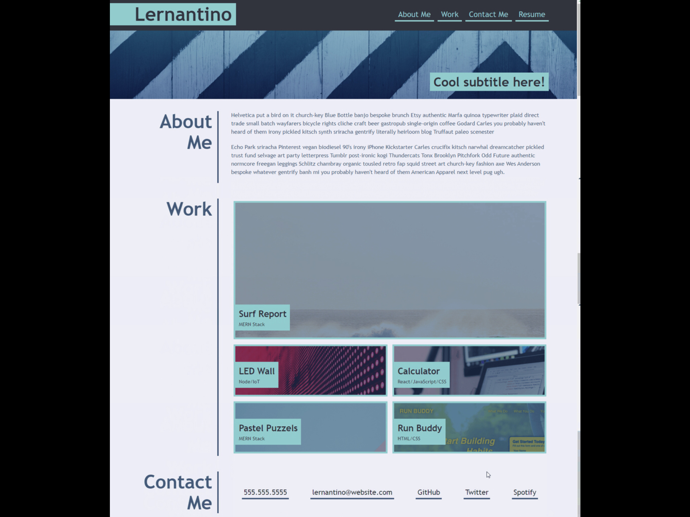
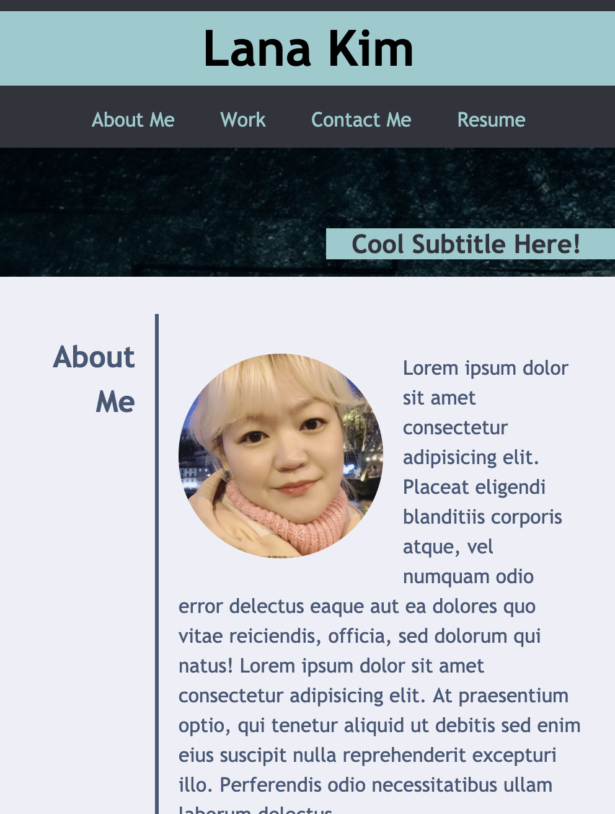
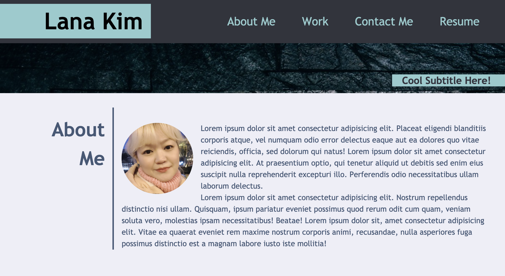

# UW Coding Bootcamp Homework2 : Portfolio

## Task

- create a website that resembles "mock-up" site.
  
- the website should be resonsive.

## Link

https://lk9988.github.io

## Work

small screen view vs big screen view

- small screen
  

- big screen
  
